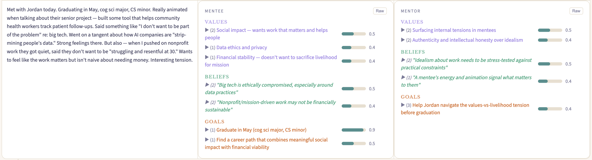
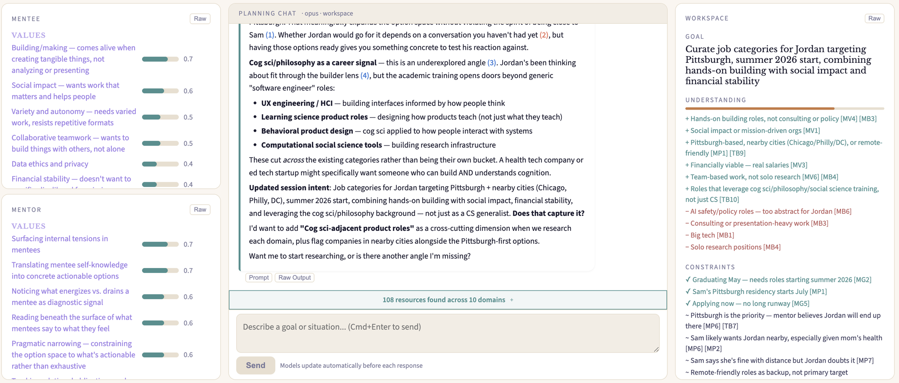
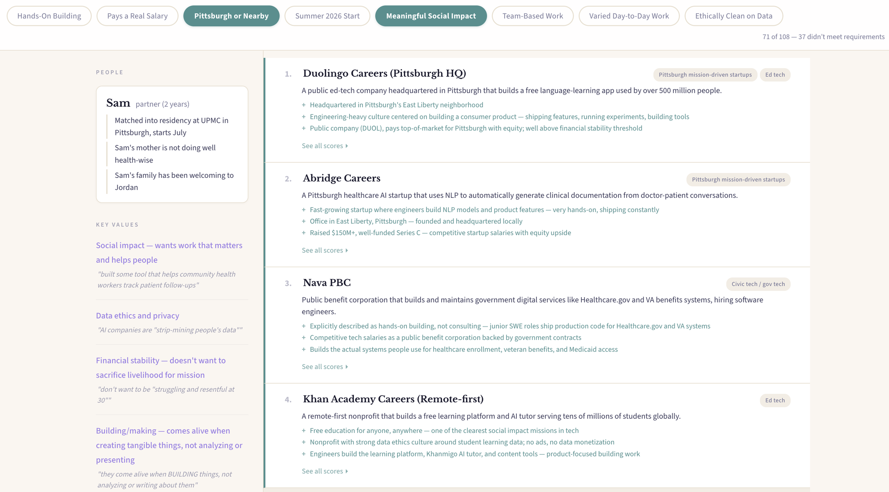

# AI Mentor Copilot

In mentoring, the relationship is what drives change. But mentors often lack knowledge: which programs exist, which career paths fit, which resources are available for someone with specific values, constraints, and relationships. AI has that knowledge. The problem is that using AI *during* a session destroys the relationship. It breaks presence, overwhelms with unreadable output, loses personalization over long conversations, and fabricates information about the people it's trying to help.

This is a sociotechnical problem: how do you get AI's knowledge to the mentor without putting AI in the room, and how do you keep that knowledge faithful to who the mentee actually is?

This project grew out of a grant proposal to the [GitLab Foundation Future of Work program](https://www.gitlabfoundation.org/futureofwork), where it was selected as a finalist (top 7%). This repo is the implementation. It builds structured, evolving models of people from unstructured text (mentor notes), then uses those models *before* sessions to search for and score real resources personalized to them. The mentor shows up prepared. The AI stays out of the conversation.

[Blog post: what I learned building this](https://infinitecare.substack.com/p/what-i-learned-building-an-ai-mentor)

## 1. Maintaining a user model



Each mentor note updates two structured models: one of the mentee, one of the mentor. The layout above shows a note (left) and the two models extracted from it (center and right).

**The mentee model** captures values, beliefs, goals, and key relationships. Each field carries a confidence score (0-1) and accumulates evidence across notes. The `(2)` prefix means two notes contributed evidence for that entry. Beliefs are quoted from the mentee's words, never paraphrased: *"Big tech is ethically compromised, especially around data practices."*

**The mentor model** captures the mentor's own attention patterns, framing, and blind spots. "Surfacing internal tensions in mentees" (0.5) describes what the mentor focuses on. "Help Jordan navigate the values-vs-livelihood tension before graduation" (0.4) is the mentor's goal, not the mentee's. The same note is evidence about both people: what the mentor chose to write down is as revealing as what the mentee said.

**People and theory of mind.** We're a deeply social species. Who the mentee cares about shapes what options are viable. The model represents specific people in the mentee's life with two sub-arrays: **situation** (observable facts: "Matched into residency at UPMC in Pittsburgh") and **innerModel** (the mentee's interpretation of what this person thinks or feels: "Sam's mother is not doing well health-wise"). This is a second-order theory of mind representation: what does person A think person B thinks? In an ideal world, you'd represent the relationships themselves as full models. Here, we use a list of people with attributed beliefs. It's a simplification, but it's enough to flag tensions during planning (e.g., a job opportunity that conflicts with a partner's constraints).

**Bounded capacity.** The model has a fixed size. Each update replaces the prior estimate rather than appending to an unbounded log. Confidence scores on every field. Evidence is direct quotes, never fabricated. What to forget is delegated to the LLM's judgment via prompts; formalizing this as a retention policy is an open problem.

**Schema-free.** The model schema is not hardcoded. `UserModel` is `Record<string, unknown>`, and the system dispatches on shape at runtime: arrays get add/update/remove deltas, objects with sub-arrays get nested merging. The schema emerges from the LLM's output, guided by the prompt's JSON template. Whether the LLM discovers useful structure beyond what the template suggests is an open question about inductive bias.

## 2. AI workspace



The planning tab has three panes: models (left), conversation (center), workspace (right).

The core design problem: if the AI dumps its reasoning into the chat, the mentor drowns in text. The solution is to give the AI its own **workspace** (right pane) where it can freely write, annotate, and track structured state without cluttering the conversation.

The **workspace** tracks: a **Goal** summarizing the mentor's intent, **Understanding** (scoring dimensions derived from the model, tagged with citations like `+ Hands-on building roles, not consulting or policy [MV4] [MB3]`), and **Constraints** (confirmed requirements `✓ Graduating May [MG2]` vs. soft inferences `~ Sam likely wants Jordan nearby [MP6] [MP2]`). The `+` and `~` prefixes indicate fit vs. tension.

The **conversation** (center) stays focused. The agent asks questions, presents options, and confirms intent. Heavy reasoning goes to the workspace, not the chat.

## 3. Model-cited reasoning

Every model entry gets a numbered ID: `[MV1]` for the first mentee value, `[MB2]` for the second mentee belief, `[MP3]` for the third person-claim. The AI is required to cite these IDs when making suggestions. In the planning chat, `(1)`, `(2)`, `(3)` reference specific model entries. In the workspace, dimensions like `+ Social impact or mission-driven orgs [MV1]` trace back to a specific value with specific evidence.

This is not just provenance. Forcing the model to cite its sources when reasoning is a hypothesis about adherence: **if the LLM must reference the user model explicitly in its output, it stays grounded in what the person actually said rather than drifting toward generic advice.** This is testable. Compare cited vs. uncited responses on the same queries and measure how often the output reflects the specific person vs. a generic archetype.

The citation IDs flow from the model through the planning chat to the workspace to the final artifact. Every recommendation in the resource board traces back to a specific model entry.

## 4. Interactive resource page



After researching across multiple domains, the system scores resources on dimensions derived from the mentee's model and produces an interactive artifact page.

**Filter pills** across the top are the scoring dimensions: "Hands-On Building," "Pittsburgh or Nearby," "Meaningful Social Impact," "Ethically Clean on Data." The mentor toggles dimensions on/off and the ranking updates live. "71 of 108 — 37 didn't meet requirements" reflects the current filter state.

The **left sidebar** shows the person model that grounds the scoring: key values with evidence quotes from the original notes, and the `people` field showing relationship constraints.

The **resource list** (right) shows ranked results. Each resource has domain tags, a one-line description, and expandable per-dimension scores. The mentor sees why something ranks high and can override it.

This solves the wall-of-text problem. Instead of 5 pages of reasoning with no clear answer, decisions are structured visually. The mentor can explore: "what if financial stability matters more than location?" Toggle, re-rank, see what changes.

## Architecture

- **Runtime**: Bun
- **Frontend**: React 18 + TypeScript, Vite dev server
- **Backend**: Express server that proxies to `claude -p` (Claude CLI). No API key needed.
- **Persistence**: Sessions saved as JSON files on disk. No database. Prompts cached in localStorage.
- **AI**: All LLM calls go through a single `/api/process` endpoint that spawns `claude -p --output-format json`.

## Running locally

Prerequisites: [Bun](https://bun.sh), [Claude CLI](https://docs.anthropic.com/en/docs/claude-code) with an active subscription.

```bash
bun install

# Start the backend (port 3001)
bun run server.ts &

# Start the frontend (port 5174)
bunx vite
```

Open `http://localhost:5174`. Paste or drag-drop mentor notes into the timeline.

## Status

This is an active personal project. The pipeline works end-to-end and the resource finding, scoring, and chat have been useful in practice, but I haven't run systematic evaluations yet. The immediate question is whether prediction accuracy correlates with downstream planning quality: whether a better model produces better-scored resources. I'm open to collaborators, especially on evaluation methodology and scaling beyond single-case mentoring.

## Project structure

```
├── server.ts                     # Express server, proxies to claude -p
├── src/
│   ├── App.tsx                   # Main app: timeline + planning tabs
│   ├── types.ts                  # UserModel, ProcessingStep, PlanningWorkspace
│   ├── update.ts                 # Model update pipeline, delta merging, prediction, planning
│   ├── prompts.ts                # All LLM prompts (editable at runtime)
│   ├── generateArtifactPage.ts   # Self-contained HTML artifact generator
│   ├── theme.ts                  # Color palette, typography
│   └── components/
│       ├── TimelineRow.tsx       # Single note: note + posterior models
│       ├── ModelView.tsx         # Renders a UserModel with color-coded sections
│       ├── StepTrace.tsx         # Expandable processing trace (prompts, raw responses)
│       ├── PlanningTab.tsx       # Research librarian conversation + workspace
│       ├── WorkspacePanel.tsx    # Domain list, resource scoring, artifact generation
│       ├── PromptEditor.tsx      # Edit any prompt at runtime, reset to defaults
│       ├── SessionBar.tsx        # Save/load/duplicate sessions
│       └── ErrorBoundary.tsx     # React error boundary
├── package.json
├── vite.config.ts
├── tsconfig.json
└── tests/                        # Test data (gitignored, private notes)
```
